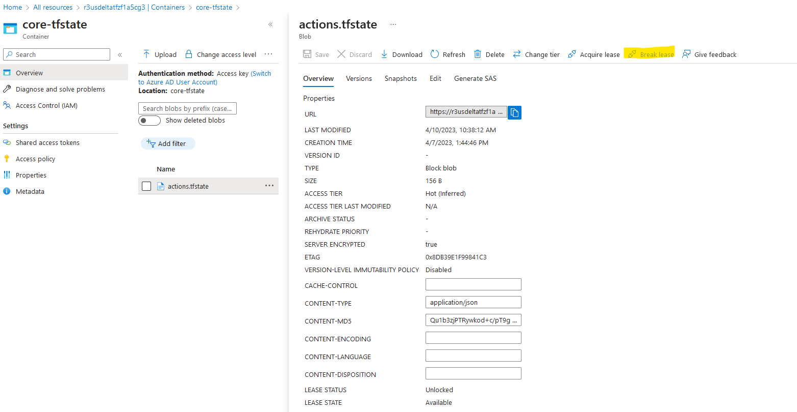

# Reb3Modules Repository
The modules repository is a part of a group of repositories, similar to a hub and spoke arrangement where the hub repository, namely Reb3Modules is the central
repository being used by the spoke repositories. The spoke repositores are those which use the reusable module specifications in the Reb3Modules hub repository to build their environment.
In the current proof of concept state, the spoke repositories are Reb3Delta, Reb3Epsilon, and Reb3Walm all of which use the same set of modules from the Reb3Modules repository.
## Rationale for a multiple repository approach
I have looked at the monorepo layout and the polyrepo layout also called multi-repo layout and their advantages and drawbacks and consulted the write-up at https://earthly.dev/blog/monorepo-vs-polyrepo/

Because of the impact that the decision of the repository structure has on releases, issue-tracking, and permissions, I have decided for a poly-repo layout.
## Workflows
The idea of the poly-repo structure is that each spoke repository can have its own workflow and deployments are made based on triggering events such as a push or a pull-request in a spoke repository. At the same time, we need to be able to trigger the workflows in the spoke repository if a triggering event occurs in the hub repository. GitHub does not natively support the execution of workflow b in repository B if a push in repository A happens causing a workflow a. This can be accomplished by running cron events in the spoke repositories checking for changes in releases in the hub repository.

I have currently decided to delay the introduction of a cron job and to create a general workflow for the Reb3Modules repository causing the build for each spoke repository by scheduling a build job for each spoke repository via the following steps for each spoke:
```
delta:
    runs-on: ubuntu-latest
    steps:
    # The order of checkouts is important because of cleaning and the step afterwards will not find anything
    # unless there is a specific path specified!

    # Checkout client files to root folder
      - name: Checkout Client
        uses: actions/checkout@v3
        with:
          repository: WolfgangBaeck/REB3Delta

      # Checkout the module repository to separate folder protecting root file system    
      - name: Checkout Modules
        uses: actions/checkout@v3
        with:
          repository: WolfgangBaeck/REB3Modules
          path: modules

      - name: Show FileSystem
        run: ls -R

      - name: Run Terraform Action
        uses: ./modules/.github/actions/terraformdeploy
```
The code section above will be repeated for each spoke repository that is coded in the workflow yaml file in the Reb3Modules repository.

## Reusable actions
Since we need to run the deployment for each client separately either in parallel or in sequence depending on our desire and the ability of Azure to cope with it, it is meaningful to embed the repetitive Terraform actions in its own action.yml file to be called for each job. This happens in the code above at the line of:

```
name: Run Terraform Action
 uses: ./modules/.github/actions/terraformdeploy
```
because the modules repository is checked out to the folder ./modules and not the root folder on the runner, we need to refer to the modules folder when calling the reusable (composite) action.

## Environment variables and secrets
Currently, the workflow in the Reb3Module repository is making use of environment variables for the entire workflow like so:

```
name: Deploy All
on:
  workflow_dispatch:
env:
  ARM_CLIENT_ID: ${{ secrets.ARM_CLIENT_ID }}
  ARM_CLIENT_SECRET: ${{ secrets.ARM_CLIENT_SECRET }}
  ARM_TENANT_ID: ${{ secrets.ARM_TENANT_ID }}
  ARM_SUBSCRIPTION_ID: ${{ secrets.ARM_SUBSCRIPTION_ID }}
jobs:
  Delta:
  ...
  Epsilon:
  ...
  ...
  Walm
```
This implies that all the workflow jobs share the same secrets. If this isn't appropriate because we have different subscription ids for each client repository which is trivial to set in each client repository and the respective workflow, we will have to now employ job specific secrets in the Reb3Module repository:
```
name: Deploy All
on:
  workflow_dispatch:
jobs:
  Delta:
    env:
        ARM_CLIENT_ID: ${{ secrets.Delta_ARM_CLIENT_ID }}
        ARM_CLIENT_SECRET: ${{ secrets.Delta_ARM_CLIENT_SECRET }}
        ARM_TENANT_ID: ${{ secrets.Delta_ARM_TENANT_ID }}
        ARM_SUBSCRIPTION_ID: ${{ secrets.Delta_ARM_SUBSCRIPTION_ID }}
  ...
  Epsilon:
    env:
        ARM_CLIENT_ID: ${{ secrets.Epsilon_ARM_CLIENT_ID }}
        ARM_CLIENT_SECRET: ${{ secrets.Epsilon_ARM_CLIENT_SECRET }}
        ARM_TENANT_ID: ${{ secrets.Epsilon_ARM_TENANT_ID }}
        ARM_SUBSCRIPTION_ID: ${{ secrets.Epsilon_ARM_SUBSCRIPTION_ID }}
  ...
  ...
  Walm
```
It is obvious that this can result in a number of problems since we have the information now in more than one place.
# Spoke Repository
Spoke repositories are all those that utilize the Reb3Module repository to implement the Terraform code necessary for a complete client deployment. Examples are Reb3Walm and Reb3Kroger for example. Spoke repositories have their own deployment and destroy definitions as well as their own set of secrets holding the necessary information for tenent, client, subscription, and secrets which must be kept in synch with the Reb3Module secrets if the intent to run all spoke deployments automatically upon a deployment in the Reb3Module repository.
## Spoke Repository Creation
When creating a repository for a new client, several steps have to be completed in the right order:
1. Creating the client repository and uploading the terraform code for the client
2. Adding the secrets for the action workflow to the repository, typically tenantid, clientid, clientsecret, subscriptionid.
3. Creating the backend Terraform state repository as an Azure storage account. The creation of the state storage account presents us with a chicken - egg problem and will therefore most like stay a separate terraform or powershell script.
4. Updating the client's provider.tf file with the appropriate storage account information (the example below is for WALM):

```
terraform {
    backend "azurerm" {
    resource_group_name  = "r3uswalm-tfstate-rg"
    storage_account_name = "r3uswalmtftp885kev"
    container_name       = "core-tfstate"
    key                  = "actions.tfstate"
  }
  required_providers {
    azurerm = {
      source = "hashicorp/azurerm"
      version = "3.46.0"
    }
  }
}
```
## Statefile Lock Conflict Resolution
The terraform state for each client is currently maintained in an Azure storage account unless and until we may move to Terraform Cloud. The storage accounts are required to be in the same subscription as the client subscription, in it's own resource group,  and currently the account naming condition is r3us<clientname><randomstring> all lower case, no special characters, no spaces. 
The naming for the resource group is currently r3us<clientname>-tfstate-rg.
Each Azure storage account has a blob container named core-tfstate and the blob is named actions.tfstate. The Terraform creation script is:
```
# Generate a random storage name
resource "random_string" "tf-name" {
  length = 8
  upper = false
  numeric = true
  lower = true
  special = false
}
# Create a Resource Group for the Terraform State File
resource "azurerm_resource_group" "state-rg" {
  name = "${lower(var.client)}-tfstate-rg"
  location = var.location
  
  lifecycle {
    prevent_destroy = true
  }  
  tags = {
    client = var.client
  }
}
# Create a Storage Account for the Terraform State File
resource "azurerm_storage_account" "state-sta" {
  depends_on = [azurerm_resource_group.state-rg]  
  name = "${lower(var.client)}tf${random_string.tf-name.result}"
  resource_group_name = azurerm_resource_group.state-rg.name
  location = azurerm_resource_group.state-rg.location
  account_kind = "StorageV2"
  account_tier = "Standard"
  access_tier = "Hot"
  account_replication_type = "ZRS"
  enable_https_traffic_only = true
   
  lifecycle {
    prevent_destroy = true
  }  
  
  tags = {
    client = var.client
  }
}
# Create a Storage Container for the Core State File
resource "azurerm_storage_container" "core-container" {
  depends_on = [azurerm_storage_account.state-sta]  
  name = "core-tfstate"
  storage_account_name = azurerm_storage_account.state-sta.name
}
```
When the state file has the "LEASE STATUS" of "unlocked" a Terraform process can run and require the exclusive lock on this state file. If the state is "locked" then either a process is currently running or a process may have been deleted and therefore wasn't able to release the lock. In that case, one needs to go to the contain end break the lease:



# State Separation for Environments (Prod, Test, Dev)
The aspect of state separation, whether via directories or workspaces has not been approached yet. Directory separated environments will rely on duplication of Terraform code with the result of creating drift between the environments over time. If we where to attempt environment separation via workspaces, we would be forced to manage the workspaces in the CLI.
I had no time yet to investigate the idea presented by Microsoft to employ TerraGrunt for this.